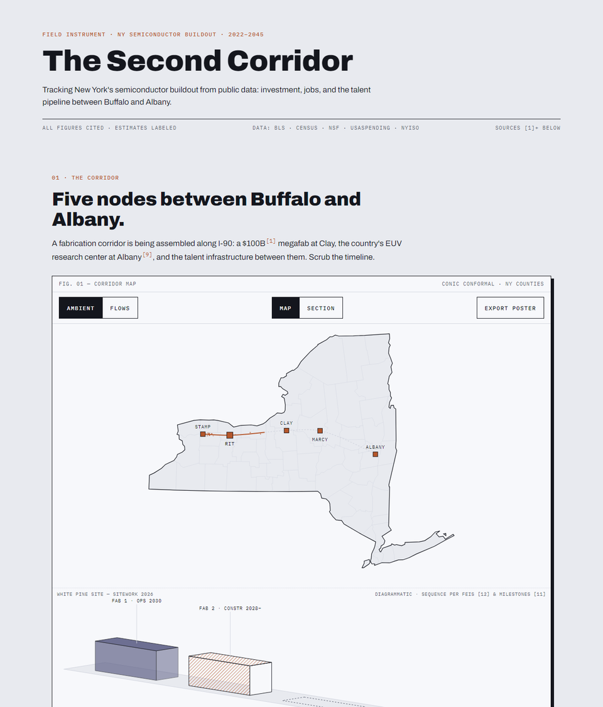

# The Second Corridor



**Live: https://second-corridor.vercel.app** · deep link: [`#y=2030`](https://second-corridor.vercel.app/#y=2030) · skip the intro: `?nointro`

Verified at the Wave 9 close (2026-06-11): Lighthouse **0.98 / 1.0 / 1.0**
(performance / accessibility / best-practices, lab median of 3), CLS 0.004,
LCP 1.86s, axe **zero findings** with an empty allowlist. Main-page bundle
**~65KB gzipped** JS+CSS — below the launch baseline raw, despite eight more
waves of product (the poster and tour modules lazy-load). Offline proof: zero
external requests, zero console errors (`node qa/offline.mjs`).

An interactive, single-purpose tracker of New York State's semiconductor buildout
(2022–2045), assembled entirely from public data. One master scrubber drives a
corridor map, a derived-series chart, dials, a milestone ledger, and a
measured-reality suite refreshed from BLS, Census, NSF, USAspending, and NYISO
with one command.

**Why this exists.** The Micron megafab at Clay, the CHIPS Act, and Albany
NanoTech are usually discussed as headlines. This instrument lays the published
plan (sections 01–05, every figure cited) against the measured reality
(sections 06–11, fetched from public statistical agencies) so a policy reader
can check one against the other — and lift any number into their own documents
with its source attached.

## Architecture

```
scripts/        Node data pipeline — run manually (`npm run data`), never at runtime
public/data/    committed aggregates only, each with an embedded provenance object
src/            vanilla JS + D3 v7 + d3-sankey + topojson-client (vendored, no CDN)
qa/             Playwright visual-QA harness (dev only)
```

- **No frameworks, no trackers, no external requests after build.** Fonts are
  self-hosted latin-subset woff2. All data is committed JSON.
- **Projection:** `d3.geoConicConformal().parallels([40.5, 44.5]).rotate([76.5, 0])`,
  fitted to each panel.
- **Geometry:** `us-atlas` counties-10m filtered to FIPS 36, simplified to ~35%
  detail, quantized (~0.005°), emitted as TopoJSON (13.2KB); the state outline is
  derived client-side via `topojson.merge`.
- **Design system is enforced mechanically:** the build fails if `border-radius`,
  `gradient`, or `backdrop-filter` appears in shipped CSS (`scripts/lint-design.mjs`).

## Refresh & deploy

The data refreshes itself: a scheduled workflow fetches, validates, diffs,
archives, and opens a reviewed PR; new-period-only refreshes auto-merge after
72h; merging to `main` IS the deploy (Vercel Git integration). Architecture,
failure-mode labels, API conduct, and **rollback** live in
[docs/pipeline.md](docs/pipeline.md).

```sh
npm install
npm run data:check   # dry run — print what a refresh would change, write nothing
npm run data         # full refresh → public/data/*.json (writes on real change)
npm run geo          # rebuild NY geometry from us-atlas
npm run og           # rebuild og.png + the per-section share cards
npm run build        # sources → CSVs/zip → cards → pages/feed → vite → lints
node qa/health.mjs   # post-deploy: production serves what main says
```

Deep links: `https://second-corridor.vercel.app/#y=2030` opens the instrument at
a given year. `?nointro` skips the plotter opening. `?embed=figNN` is the embed
mode; `/f/01`–`/f/12` are per-figure share URLs.

QA battery (Wave 1 gates; see `CLAUDE.md` for the session ritual):
`npm run build` (design lint + bundle-size gate vs `perf-budget.json`) ·
`npm test` (derived-series + citation-gate units) · `node qa/offline.mjs`
(zero external requests) · `node qa/contract.mjs` (plates render, fixtures,
axe a11y, subpages) · `node qa/visual-diff.mjs` (pixelmatch vs `qa/baselines/`,
local only, pinned clock) · `node qa/print.mjs` (print-path smoke; `--publish`
regenerates `public/brief.pdf`) · `node qa/perf.mjs [--throttle]` (runtime
trace) · `npm run lighthouse` (budget asserted). `npm run qa` screenshots years {2022, 2026, 2030, 2045} ×
widths {375, 768, 1280} into `qa/shots/` (gitignored) for visual review.
CI (`.github/workflows/ci.yml`) runs build, units, offline proof, contract,
and Lighthouse on every push to main and every PR.

**Poster:** the EXPORT POSTER control downloads a self-contained
A2-proportioned SVG (fonts embedded as data URIs) of the instrument at the
current scrub year. To print it: open the SVG in any browser → print → save
as PDF at A2 paper size (or scale-to-fit on A3/letter). The title block
records the year, draw date, and build revision.

**Print brief:** Cmd/Ctrl+P on the site itself produces a PDF brief — canvas
and controls hidden, a mono header with the frozen scrub year and every data
vintage, and clean page breaks between sections 06–11.

## Data integrity

- **Derived series (sections 01–02) are interpolations, not forecasts.** Rules:
  `invest` linear through (2022, 0) → (2030, $20B) → (2045, $100B); `constr` a
  band ramping (2025, 0) → (2027, 3,000–4,000), held flat at the only cited
  figure through 2041, ramp-down to (2042, 0) is illustrative; `perm` linear
  (2029, 0) → (2045, 9,000); `supply` = cited ~50,000 total minus cited 9,000
  direct, linear (2029, 0) → (2045, 41,000). Every chart carrying them is
  labeled `INTERPOLATED BETWEEN CITED ANCHORS — NOT A FORECAST`.
- **Suppression is information.** QCEW small-cell suppression renders as
  "suppressed (BLS confidentiality)", never zero. OEWS unavailable cells render
  as such.
- **LODES measures all-industry commuting** into Onondaga County jobs — the
  labor-market geometry the fab plugs into, not semiconductor-specific flows.
  OD files carry no industry breakout and the instrument does not imply one.
- **Announced ≠ obligated ≠ outlaid.** CHIPS direct funding disburses against
  milestones; a gap between obligation and outlay is the design of the
  agreement, not delay. Green CHIPS is a New York State performance-based tax
  credit and never appears in federal spending data.
- **Vintages render from provenance objects** embedded by the fetch scripts —
  never from strings in markup.
- Fetch scripts fail loudly on schema drift or missing data. No placeholders.

## Provenance — verified figures (sections 01–05)

Every anchor figure was located in a primary public source and then
adversarially re-verified against the live document (retrieved 2026-06-10).

| Figure | Claim | Source | Published |
|---|---|---|---|
| micron-100b | Up to $100B over 20+ years, megafab at Clay — largest private investment in NYS history | [Micron press release](https://www.globenewswire.com/news-release/2022/10/04/2527958/0/en/Micron-Announces-Historic-Investment-of-up-to-100-Billion-to-Build-Megafab-in-Central-New-York.html) | 2022-10-04 |
| micron-9000-direct | ~9,000 direct Micron jobs | [Micron press release](https://www.globenewswire.com/news-release/2022/10/04/2527958/0/en/Micron-Announces-Historic-Investment-of-up-to-100-Billion-to-Build-Megafab-in-Central-New-York.html) | 2022-10-04 |
| micron-50000-total | Nearly 50,000 NY jobs total (9,000 direct + 40,000+ community) | [Governor's office](https://www.governor.ny.gov/news/hochul-schumer-mcmahon-announce-micron-coming-onondaga-county-micron-will-invest-unprecedented) | 2022-10-04 |
| micron-20b-first-phase | First-phase ~$20B by end of decade | [Micron press release](https://www.globenewswire.com/news-release/2022/10/04/2527958/0/en/Micron-Announces-Historic-Investment-of-up-to-100-Billion-to-Build-Megafab-in-Central-New-York.html) | 2022-10-04 |
| green-chips-5_5b | $5.5B Green CHIPS package | [Governor's office](https://www.governor.ny.gov/news/hochul-schumer-mcmahon-announce-micron-coming-onondaga-county-micron-will-invest-unprecedented) | 2022-10-04 |
| green-chips-structure | Performance-based tax credits, realized as milestones are met | [Empire State Development](https://esd.ny.gov/green-chips) | current page |
| chips-act-2022 | CHIPS and Science Act signed Aug 9, 2022 (P.L. 117-167) | [Congress.gov](https://www.congress.gov/bill/117th-congress/house-bill/4346) | 2022-08-09 |
| chips-direct | Up to $6.165B CHIPS direct funding, finalized Dec 9–10, 2024 | [NIST](https://www.nist.gov/news-events/news/2024/12/department-commerce-awards-chips-incentives-micron-idaho-and-new-york) · [Micron 8-K](https://www.sec.gov/Archives/edgar/data/723125/000110465924127174/tm2430615d1_8k.htm) | 2024-12 |
| upwards-2023 | UPWARDS launched 2023; RIT one of six US universities | [RIT News](https://www.rit.edu/news/growing-collaboration-advances-semiconductor-industry) | 2025-01-07 |
| emerge-micro-2024 | NSF EMERGE-MICRO award — RIT + MCC + FLCC | [NSF award 2347157](https://www.nsf.gov/awardsearch/showAward?AWD_ID=2347157) | 2024-07-08 |
| euv-825m | ~$825M NSTC EUV Accelerator at Albany | [NIST](https://www.nist.gov/news-events/news/2024/10/biden-harris-administration-announces-ny-creates-albany-nanotech-complex) | 2024-10-31 |
| euv-operational-2025 | EUV Accelerator operational July 1, 2025 | [Natcast](https://www.prnewswire.com/news-releases/natcast-celebrates-grand-opening-of-nstc-euv-accelerator-at-ny-creates-albany-nanotech-complex-one-of-three-nstc-flagship-semiconductor-rd-facilities-across-the-country-302504465.html) | 2025-07-14 |
| groundbreaking-2026 | Official groundbreaking January 16, 2026 | [Micron press release](https://www.globenewswire.com/news-release/2026/01/16/3220324/14450/en/Micron-Celebrates-Official-Groundbreaking-at-New-York-Megafab-Site.html) | 2026-01-16 |
| fab phasing (2026 Q2 constr → 2028 Fab 1 structure/Fab 2 → 2030 ops → 2033 Fab 3 → 2039 Fab 4 → 2041 constr end → 2045 full ops) | Four-fab construction & ramp schedule | [Micron NY Final EIS, CHIPS Program Office & OCIDA](https://ongoved.com/wp-content/uploads/2025/11/2025_1105_MicronNY_FEIS_Final.pdf) (+ [App. B-5](https://ongoved.com/wp-content/uploads/2025/11/2025_1105_MicronNY_FEIS_Appendix_A-D.pdf)) | 2025-11 |
| constr-3000-4000 | 3,000–4,000 construction workers on site | [Onondaga County, 2026 State of the County](https://onondaga.gov/communications/2026/03/28/county-executive-mcmahon-delivers-2026-state-of-the-county-address/) | 2026-03-28 |
| ny-88-establishments-2022 | 88 semiconductor establishments (April 2022) | [Governor's office](https://www.governor.ny.gov/news/governor-hochul-announces-new-team-guide-states-strategy-become-nations-leading-hub) | 2022-04-22 |
| ny-156-companies / ny-34000-workers | 156+ semiconductor & supply-chain companies, 34,000+ workers | [Empire State Development](https://esd.ny.gov/industries/semiconductors) | current page |
| rit-cleanroom / rit-150mm | Class-1000 cleanroom (Semiconductor Nanofabrication Lab), 150mm CMOS line | [RIT program page](https://www.rit.edu/study/microelectronic-engineering-bs) · [SNL tool set](https://www.rit.edu/nanofab/tool-set) | current pages |
| rit-1500-alumni | 1,500+ microelectronic engineering alumni in industry | [RIT News](https://www.rit.edu/news/computer-chip-technology-aligns-rits-microelectronic-engineering-program-growth) | 2022-04-12 |
| rit-coop-48 | 48 required co-op weeks (four blocks) | [RIT program page](https://www.rit.edu/study/microelectronic-engineering-bs) | current page |
| node-stamp | STAMP mega-site, Genesee County (Edwards Vacuum $319M) | [Governor's office](https://www.governor.ny.gov/news/governor-hochul-and-majority-leader-schumer-announce-major-semiconductor-supply-chain) | 2022-11-02 |
| node-marcy | Wolfspeed 200mm SiC fab, Marcy Nanocenter, Oneida County | [Empire State Development](https://esd.ny.gov/esd-media-center/press-releases/governor-hochul-announces-grand-opening-wolfspeeds-1-billion-silicon-carbide-fabrication-facility-mohawk-valley) | 2022-04-25 |
| node-albany | Albany NanoTech Complex, NSTC EUV Accelerator | [Governor's office](https://www.governor.ny.gov/news/governor-hochul-announces-grand-opening-nstc-euv-accelerator-ny-creates-albany-nanotech) | 2025-07-14 |
| node-clay | White Pine Commerce Park, Town of Clay, Onondaga County | [Governor's office](https://www.governor.ny.gov/news/hochul-schumer-mcmahon-announce-micron-coming-onondaga-county-micron-will-invest-unprecedented) | 2022-10-04 |
| node-rit | RIT microelectronic engineering programs | [RIT News](https://www.rit.edu/news/rit-expands-its-workforce-initiatives-semiconductor-industry) | 2024-07-26 |
| occ-micron | $15M Micron Cleanroom Simulation Lab at Onondaga Community College (funded $5M each by Micron, Onondaga County, NYS/SUNY); Micron-aligned Electromechanical Technology AAS + certificate | [Governor's office](https://www.governor.ny.gov/news/governor-hochul-unveils-plans-15-million-micron-cleanroom-simulation-lab-onondaga-community) | 2023-10-19 |
| ann-tsmc-az | TSMC Arizona announced May 15, 2020 | [TSMC](https://pr.tsmc.com/english/news/2033) | 2020-05-15 |
| ann-intel-oh | Intel Ohio announced January 21, 2022 | [Intel](https://www.intc.com/news-events/press-releases/detail/1521/intel-announces-next-us-site-with-landmark-investment-in) | 2022-01-21 |
| ann-micron-id | Micron Boise announced September 1, 2022 | [Micron](https://www.globenewswire.com/news-release/2022/09/01/2508617/0/en/Micron-to-Invest-15-Billion-in-New-Idaho-Fab-Bringing-Leading-Edge-Memory-Manufacturing-to-the-US.html) | 2022-09-01 |
| ann-samsung-tx | Samsung Taylor TX announced November 2021 | [Samsung](https://news.samsung.com/global/samsung-electronics-announces-new-advanced-semiconductor-fab-site-in-taylor-texas) | 2021-11-24 |

Live-data sources (sections 06–11) carry their vintages in the provenance
objects inside `public/data/*.json` and in the on-page Sources list.

## Decisions

1. **CHIPS direct funding is rendered itemized, contradicting the spec's
   framing.** The spec called for a single sankey band labeled "single
   agreement, NY share not itemized." Micron's SEC Form 8-K (Dec 9, 2024)
   itemizes the finalized award: $4.6B for Clay Fabs 1–2, $1.5B for Boise, up
   to $65M for workforce — executed as *two* funding agreements under one
   finalized award. Shipping the spec's label would have shipped a false
   statement; the itemized, citable version renders instead. **Flagged for
   author review.**
2. **The spec's ~$12M federal workforce figure is omitted.** No ~$12M figure
   exists in the public record (searched NSF, NIST, Commerce, White House, DOL,
   Natcast). The citable figures are $40M (April 2024 preliminary terms,
   superseded) and up to $65M (final agreements). The $65M renders, cited to
   the 8-K.
3. **"88 NY semiconductor companies" is date-qualified.** The 88 figure is the
   state's April 2022 count of *establishments*; the state's current count is
   156+ companies (ESD). Both render in section 05 with dates; the talent
   sankey's supplier node uses 156+.
4. RIT's cleanroom is labeled by its current name (Semiconductor
   Nanofabrication Lab; formerly SMFL), and the 1,500+ alumni figure is scoped
   to the microelectronic engineering program, per the cited sources.
5. **Jobs chart composition:** perm + supply are stacked from zero (stack top =
   the cited ~50,000 at 2045); the constr band is *overlaid* at its own cited
   3,000–4,000 values rather than stacked, to avoid implying a stacked total
   that mixes a range with point series.
6. The corridor trace fill is a scrub-position progress indicator (a timeline
   cursor in space), not a data series. Node activation years come from the
   cited milestones (Clay/STAMP/Marcy 2022, RIT 2023, Albany 2024).
7. Capital sankey bands below 1.25px at true scale (the $65M workforce grant)
   are drawn at a 1.25px minimum, noted on the plate.
8. Geometry ships as TopoJSON (smaller than GeoJSON); the state outline merges
   client-side.
9. The OG card renders via `@resvg/resvg-js` with the committed woff2 fonts
   decompressed to TTF at build time (sharp on Windows lacks reliable custom
   font loading).
10. Git identity is repo-local placeholder (`Aharr <aharr@localhost>`).
11. Comparator announcement-date nuances (per the verified primary sources):
    TSMC's May 15, 2020 release names Arizona but not Phoenix; Intel's Jan 21,
    2022 release names Licking County but not New Albany; Samsung's newsroom
    dateline is Nov 24, 2021 (KST) for the Nov 23 US-time announcement.
12. **The spec's IPEDS unitids were wrong** — 193283 is Mohawk Valley CC and
    191676 is Houghton University. Corrected via the IPEDS directory to
    193326 (Monroe Community College) and 191199 (Finger Lakes Community
    College); the fetch script asserts institution names on every run.
13. **Urban Institute's completions year labels are internally inconsistent**
    (fall-year before 2020, survey-year after; their 2019 and 2020 duplicate
    AY 2019-20). The fetch script re-keys everything to NCES survey years and
    pins five hand-verified values from raw NCES C-files so relabeling fails
    loudly.
14. **Micron's CHIPS funding agreements have no award record on USAspending**
    (verified across CFDA 11.037, recipient UEI, File C, and Spending
    Explorer; only the TSMC and SK Hynix loans appear). Section 08 renders
    the absence as the datapoint; a runtime self-check auto-captures the
    records if Commerce ever publishes them.
15. The Census ACS API is no longer keyless; without `CENSUS_API_KEY` the
    fetch script falls back to the official ACS 5-Year Summary File (same
    figures, documented in provenance).
16. The FLOWS legend says **JOBS**, not the spec template's WORKERS — LODES
    JT00 counts jobs (multiple jobholders count twice), and honest method
    outranks template wording. One particle = ceil(top-30 flow sum ÷
    perf cap) jobs.
17. FLOWS is geography-bound, so it is unavailable in the SECTION view
    (the tab disables; particles fall back to ambient along the datum).
18. Site panel: no citable site-plan geometry was located, so the spec's
    diagrammatic fallback renders — four schematic volumes sequenced by the
    cited milestones. Fab 1's 2026→2028 rise is cited; the same two-year
    rise is applied to Fabs 2–4 from their cited start years. Operational
    fill uses the wafer-violet token.
19. Licking County OH (Intel) is fully suppressed in QCEW for all months;
    its comparator strip renders the suppression hatch rather than being
    dropped (the announcement date is cleanly cited — only the data is
    confidential).
20. Copper on silicon (~4.0:1) is below WCAG AA's 4.5:1 for the small mono
    eyebrows and citation marks. ~~The tokens are locked and Lighthouse
    accessibility holds at 97 (≥95 gate), so the signature stays; noted for
    the author.~~ **Resolved in Wave 2 (D42):** text-only copper now uses
    `--copper-text` (#9c4a22, ≥4.9:1); marks, fills, and large type keep
    `--copper`. The axe gate runs with an empty allowlist.
21. Sections 07–11 shipped as one commit rather than five — all five data
    sources landed simultaneously, so the per-section independence the spec
    wanted (a blocked source stalls one panel, not the phase) was satisfied
    by the pipeline structure instead.
22. **Onondaga Community College added at the author's request** (it was not
    in the spec's institution list). Citation located and verified first:
    the $15M Micron Cleanroom Simulation Lab at OCC's Whitney Applied
    Technology Center (Governor's office, 2023-10-19). OCC joins the talent
    lattice (with the cleanroom lab as a cited mechanism feeding Micron
    Clay) and the IPEDS completions panel (unitid 194222, name-asserted at
    runtime; CIP 15.0403 Electromechanical Technology added to the kept
    set). OCC's Micron-aligned programs launched fall 2023, after the
    latest available completions year (AY 2021-22) — its bars show the
    pre-Micron baseline, which is the point of the panel.

## License & reuse

- **Code** (src/, scripts/, qa/, build config): [MIT](LICENSE).
- **Content & derived data** (site copy, `public/data/*.json`, generated CSVs,
  `data-archive/`): [CC BY 4.0](LICENSE-CONTENT.md) — reuse freely, including
  commercially, with attribution.
- **Upstream data** stays under its agencies' own terms — see the per-source
  [terms ledger](docs/terms-ledger.md). Each published JSON carries `license`
  and `attribution` in its `provenance` block.
- The `/data/*.json` files are a documented, stable surface:
  [data contract](docs/data-contract.md).

## Stable anchors

`#s01`–`#s12`, `#record-gaps`, `#sources`, `#src-N` (source rows), and the
`#y=YYYY` (+ `&view=` / `&p=`) instrument state are stable, versioned anchors —
inbound deep links will not be broken. `/f/01`–`/f/12` are per-figure share
URLs that redirect to the matching section. Documented on the
[methods page](https://second-corridor.vercel.app/methods#anchors).

## If this tracker goes quiet

Bus-factor honesty (R49): everything needed to carry this forward is in the
repository, and the licenses permit it.

1. **Fork it.** The refresh workflow (`.github/workflows/refresh.yml`) runs
   on a fork unchanged. You need: Actions enabled, the repo setting "Allow
   GitHub Actions to create and approve pull requests," and optionally a
   `CENSUS_API_KEY` secret (the ACS fetcher falls back to the keyless
   Summary File without it). `npm run data:check` proves the pipeline before
   you commit anything.
2. **Deploy anywhere static.** `npm run build` emits a self-contained
   `dist/` — any static host serves it (`npx vercel deploy --prod` is one
   command). Update the `SITE` constant in `vite.config.js` and
   `scripts/build-pages.mjs` if the address changes, and keep the old URL
   redirecting if you can — the stable-anchor promise is part of the work.
3. **The licenses already say yes.** Code is MIT; content and derived data
   are CC BY 4.0 — continuation with attribution is the intended outcome,
   not a courtesy. The full architecture is in `docs/pipeline.md`; the data
   surface is documented in `docs/data-contract.md`; upstream terms in
   `docs/terms-ledger.md`.

## Colophon

Built by Alex · Alex@ozarkintelligence.com.
